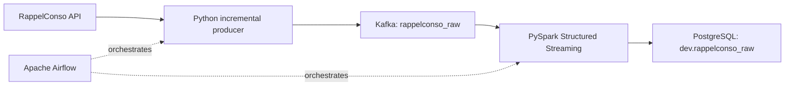

# RappelConso Data Engineering Pipeline

An incremental data pipeline that ingests French product-recall data from the
RappelConso public API, publishes raw events to Kafka, transforms them with
PySpark Structured Streaming, and performs version-aware upserts into
PostgreSQL. Apache Airflow orchestrates the workflow.

## Architecture



## Highlights

- Incremental API cursor with overlap protection and atomic state updates
- Retried HTTP requests and acknowledged Kafka publishing
- Explicit Spark schema, text normalization, date conversion, and raw JSON retention
- Version-aware deduplication within each micro-batch
- PostgreSQL `ON CONFLICT` upserts with JSONB storage
- Idempotent database migrations on every Spark run
- Airflow retries, health checks, and daily scheduling
- Reproducible Docker environment, automated tests, and GitHub Actions CI

## Validated Result

On 2026-06-29, the complete Airflow DAG finished successfully on its first
attempt and processed 17,986 Kafka messages into 17,770 unique PostgreSQL rows.
A second Spark run with the same checkpoint produced no duplicates.

## Stack

Python 3.12, Kafka 4.2, PySpark 3.5, PostgreSQL 14, Airflow 2.9, Docker Compose,
pytest, and GitHub Actions.

## Quick Start

Requirements: Docker Desktop with WSL integration, Bash, and at least 6 GB of
memory available to Docker.

```bash
git clone <repository-url>
cd France-project
chmod +x scripts/*.sh
./scripts/start.sh
```

The script creates `.env` from `.env.example` when needed, creates the shared
Docker network, builds the Airflow image, and starts all services.

| Service | URL | Credentials |
| --- | --- | --- |
| Airflow | http://localhost:8080 | `admin` / `admin` |
| Kafka UI | http://localhost:8000 | none |
| PostgreSQL | `localhost:5432` | values from `.env` |

Enable `rappelconso_pipeline` in Airflow and trigger it manually. The DAG runs:

```text
migrate_postgres -> fetch_and_produce -> spark_to_postgres
```

## Run Components Manually

```bash
python -m src.postgres_client.migrate
python -m src.kafka_client.kafka_stream_data
python -m src.spark_client.spark_stream_data
```

If Kafka storage is intentionally reset, rebuild the raw topic from the
auditable PostgreSQL payloads:

```bash
python -m scripts.replay_postgres_to_kafka
```

Useful environment overrides:

```text
KAFKA_BOOTSTRAP_SERVERS
KAFKA_TOPIC
MAX_INGEST_PAGES
API_PAGE_SIZE
API_MAX_OFFSET
POSTGRES_HOST
POSTGRES_PORT
POSTGRES_DB
POSTGRES_TABLE
SPARK_STARTING_OFFSETS
SPARK_CHECKPOINT_LOCATION
```

## Inspect Data

Kafka messages are available in Kafka UI under
`Topics -> rappelconso_raw -> Messages`.

Query the final table:

```bash
docker exec -it pipeline_postgres psql -U admin -d rappelconso
```

```sql
SELECT COUNT(*) FROM dev.rappelconso_raw;

SELECT
    numero_fiche,
    numero_version,
    date_publication,
    categorie_produit,
    marque_produit,
    libelle
FROM dev.rappelconso_raw
ORDER BY date_publication DESC
LIMIT 20;

SELECT jsonb_pretty(raw_data)
FROM dev.rappelconso_raw
ORDER BY db_id DESC
LIMIT 1;
```

Runtime data is persisted in `kafka/`, `postgres/data/`, Docker volumes, and
`data/checkpoints/`. These paths are intentionally excluded from Git.

## Tests

```bash
python -m venv .venv
source .venv/bin/activate
pip install -r requirements-dev.txt
pytest --cov=src --cov-report=term-missing
```

The suite covers producer cursor handling and deduplication, Spark schema and
normalization, version selection, upsert SQL generation, and DAG structure.

## Project Layout

```text
dags/                         Airflow DAG
scripts/                      Start, stop, and status helpers
sql/                          Initial schema and idempotent migration
src/kafka_client/             API ingestion and Kafka producer
src/postgres_client/          Database migrations
src/spark_client/             Spark transformations and PostgreSQL upserts
tests/                        Automated tests
docker-compose.yaml           Kafka and Kafka UI
docker-compose-airflow.yaml   PostgreSQL and Airflow services
```

## Operational Notes

- `availableNow=True` lets Spark process available Kafka messages and exit,
  which fits scheduled Airflow runs.
- The producer intentionally overlaps the cursor by one day. Kafka replay is
  safe because PostgreSQL upserts by a stable deduplication key.
- Older recall versions cannot overwrite newer versions.
- `raw_data` preserves the source payload for audit and reprocessing.

## Stop the Stack

```bash
./scripts/stop.sh
```

Data volumes are retained. Use `./scripts/status.sh` to inspect service health.
