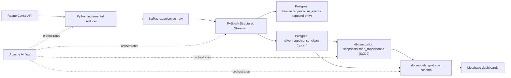

# RappelConso Data Engineering Pipeline

An incremental data pipeline that ingests French product-recall data from the
RappelConso public API, publishes raw events to Kafka, transforms them with
PySpark Structured Streaming, and builds a Medallion (Bronze/Silver/Gold) data
warehouse in PostgreSQL. Apache Airflow orchestrates ingestion and dbt builds
the Gold star schema, with Metabase for BI.

## Architecture



## Highlights

- Incremental API cursor with overlap protection and atomic state updates
- Retried HTTP requests and acknowledged Kafka publishing
- Explicit Spark schema, text normalization, date conversion, and raw JSON retention
- Bronze layer: every Kafka message appended as-is, no update/delete, full audit trail
- Silver layer: version-aware deduplication and upserts (same ODS semantics as before)
- Gold layer: dbt-built star schema with SCD2 history recovered via a dbt snapshot
- dbt tests (`not_null`, `unique`, `relationships`) and generated docs/lineage
- `audit_pipeline_runs` logs row counts and status for every DAG run
- Airflow retries, health checks, and daily scheduling
- Reproducible Docker environment, automated tests, and GitHub Actions CI

## Stack

Python 3.12, Kafka 4.2, PySpark 3.5, PostgreSQL 14, Airflow 2.9, dbt-postgres 1.9,
Metabase, Docker Compose, pytest, and GitHub Actions.

## Quick Start

Requirements: Docker Desktop with WSL integration, Bash, and at least 6 GB of
memory available to Docker.

```bash
git clone <repository-url>
cd France-project
chmod +x scripts/*.sh
./scripts/start.sh
```

The script creates `.env` from `.env.example` when needed, creates the shared
Docker network, builds the Airflow image, and starts all services.

| Service | URL | Credentials |
| --- | --- | --- |
| Airflow | http://localhost:8080 | `admin` / `admin` |
| Kafka UI | http://localhost:8000 | none |
| PostgreSQL | `localhost:5432` | values from `.env` |
| Metabase | http://localhost:3000 | `admin@example.com` / `Rappelconso123!` |

Enable `rappelconso_pipeline` in Airflow and trigger it manually. The DAG runs:

```text
migrate_postgres -> fetch_and_produce -> spark_to_postgres -> dbt_deps -> dbt_snapshot -> dbt_run -> dbt_test -> dbt_docs_generate -> log_audit
```

## Data Warehouse Layers

PostgreSQL is split into three schemas following the Medallion architecture:

- **`bronze`** (`bronze.rappelconso_events`): append-only raw events. Every
  Kafka message is inserted as-is (`raw_json`, `_ingested_at`), including
  older recall versions and replays. Never updated or deleted.
- **`silver`** (`silver.rappelconso_clean`): cleaned, typed, deduplicated
  current state, upserted by `deduplication_key` (only the latest
  `numero_version` per recall survives, same ODS semantics as before). A
  `silver_updated_at` column tracks the last time each row changed.
- **`gold`**: a dbt-built star schema for BI — `fact_rappel`, `dim_produit`,
  `dim_marque`, `dim_risque`, `dim_distributeur`, `dim_date`.

Because Silver only ever keeps the latest version of a recall, history is
recovered at the Gold layer with a **dbt snapshot**
(`snapshots.snap_rappelconso`), which uses a `timestamp` strategy on
`silver_updated_at` to capture every change as its own row (`dbt_valid_from`,
`dbt_valid_to`). `fact_rappel` is built on top of that snapshot and exposes
this as `valid_from` / `valid_to` / `is_current` — one fact row per historical
version of a recall (SCD Type 2). The four dimensions are current-state
(SCD Type 1), since they're derived attributes rather than independently
versioned entities.

The Silver upsert only bumps `silver_updated_at` (and therefore only produces
a new snapshot/SCD2 version) when the incoming row is a strictly newer
`numero_version`, or the same version with materially different content —
re-upserting an unchanged row is a no-op, so replays and reruns never
fabricate fake history.

`dim_produit`/`dim_marque`/`dim_risque`/`dim_distributeur` each carry an
`Unknown` member; `fact_rappel`'s foreign keys are `COALESCE`d to it whenever
the source attribute is `NULL`, so every FK in `fact_rappel` is `not_null`
(enforced by a dbt test) instead of silently dropping out of `relationships`
checks.

## Run Components Manually

```bash
python -m src.postgres_client.migrate
python -m src.kafka_client.kafka_stream_data
python -m src.spark_client.spark_stream_data
```

dbt is not part of `requirements.txt` (it's installed into an isolated venv in
the Airflow image, see Operational Notes). To run it locally, install it in
its own virtualenv first: `pip install dbt-postgres==1.9.1`.

```bash
cd dbt/rappelconso
dbt deps
dbt snapshot --profiles-dir .
dbt run --profiles-dir .
dbt test --profiles-dir .
dbt docs generate --profiles-dir . && dbt docs serve --profiles-dir .
```

If Kafka storage is intentionally reset, rebuild the raw topic from the
auditable PostgreSQL payloads:

```bash
python -m scripts.replay_postgres_to_kafka
```

Useful environment overrides:

```text
KAFKA_BOOTSTRAP_SERVERS
KAFKA_TOPIC
MAX_INGEST_PAGES
API_PAGE_SIZE
API_MAX_OFFSET
POSTGRES_HOST
POSTGRES_PORT
POSTGRES_DB
BRONZE_TABLE
SILVER_TABLE
SPARK_STARTING_OFFSETS
SPARK_CHECKPOINT_LOCATION
```

## Inspect Data

Kafka messages are available in Kafka UI under
`Topics -> rappelconso_raw -> Messages`.

Query the warehouse:

```bash
docker exec -it pipeline_postgres psql -U admin -d rappelconso
```

```sql
SELECT count(*) FROM bronze.rappelconso_events;
SELECT count(*) FROM silver.rappelconso_clean;
SELECT count(*) FROM gold.fact_rappel;

SELECT
    numero_fiche,
    numero_version,
    date_publication,
    categorie_produit,
    marque_produit,
    libelle
FROM silver.rappelconso_clean
ORDER BY date_publication DESC
LIMIT 20;

SELECT
    f.numero_fiche,
    f.numero_version,
    d.nom_produit,
    m.marque_produit,
    f.valid_from,
    f.valid_to,
    f.is_current
FROM gold.fact_rappel f
LEFT JOIN gold.dim_produit d ON d.produit_key = f.produit_key
LEFT JOIN gold.dim_marque m ON m.marque_key = f.marque_key
ORDER BY f.valid_from DESC
LIMIT 20;

SELECT * FROM audit_pipeline_runs ORDER BY started_at DESC LIMIT 5;
```

## Metabase

`scripts/start.sh` runs `scripts/setup_metabase.py` automatically once
Metabase is healthy: it completes the first-run setup (site name, admin
account), connects a Postgres database scoped to the `gold` schema, and
publishes a starter dashboard ("RappelConso - Vue d'ensemble") with recall
counts by category, a monthly trend, top distributors, and a total-recalls
scalar. Log in at http://localhost:3000 with `admin@example.com` /
`Rappelconso123!` (override via `METABASE_ADMIN_EMAIL`/
`METABASE_ADMIN_PASSWORD`) and open the dashboard from the home page.

The script is idempotent — safe to rerun, it skips any step already done. To
run it by hand (e.g. after `docker compose restart metabase`):

```bash
docker compose -f docker-compose-airflow.yaml exec \
  -e METABASE_URL=http://metabase:3000 \
  airflow-webserver python /opt/airflow/project/scripts/setup_metabase.py
```

## Tests

```bash
python -m venv .venv
source .venv/bin/activate
pip install -r requirements-dev.txt
pytest --cov=src --cov-report=term-missing
```

The suite covers producer cursor handling and deduplication, Spark schema and
normalization, version selection, upsert SQL generation, bronze writes,
migration registration, audit-run logic, and DAG structure.

## Project Layout

```text
dags/                         Airflow DAG
dbt/rappelconso/               dbt project (staging, gold marts, snapshot, tests)
scripts/                      Start, stop, and status helpers
sql/                          Medallion schema migrations (bronze/silver/gold/audit)
src/kafka_client/             API ingestion and Kafka producer
src/postgres_client/          Database migrations and pipeline-run audit logging
src/spark_client/             Spark transformations, bronze append, silver upserts
tests/                        Automated tests
docker-compose.yaml           Kafka and Kafka UI
docker-compose-airflow.yaml   PostgreSQL, Airflow, and Metabase services
```

## Operational Notes

- `availableNow=True` lets Spark process available Kafka messages and exit,
  which fits scheduled Airflow runs.
- The producer intentionally overlaps the cursor by one day. Kafka replay is
  safe: bronze accepts every replayed message as a new row (append-only), and
  silver still upserts by a stable deduplication key.
- Older recall versions cannot overwrite newer versions in silver.
- `raw_data`/`raw_json` preserve the source payload for audit and reprocessing.
- dbt runs from an isolated virtualenv baked into the Airflow image
  (`/home/airflow/dbt-venv`), separate from Airflow's own dependencies, to
  avoid a `protobuf` version conflict between `dbt-core` and Airflow 2.9.

## Stop the Stack

```bash
./scripts/stop.sh
```

Data volumes are retained. Use `./scripts/status.sh` to inspect service health.
